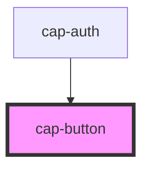

# cap-button

<!-- Auto Generated Below -->

## Properties

| Property | Attribute | Description | Type                              | Default     |
| -------- | --------- | ----------- | --------------------------------- | ----------- |
| `color`  | `color`   |             | `"primary" \| "secondary"`        | `"primary"` |
| `type`   | `type`    |             | `"button" \| "reset" \| "submit"` | `"button"`  |

## Events

| Event         | Description | Type               |
| ------------- | ----------- | ------------------ |
| `customClick` |             | `CustomEvent<any>` |

## Dependencies

### Used by

 - [cap-auth](../cap-auth)

### Graph

----------------------------------------------

*Built with [StencilJS](https://stenciljs.com/)*
