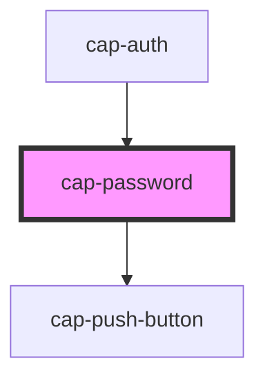

# cap-password

<!-- Auto Generated Below -->

## Properties

| Property       | Attribute       | Description | Type      | Default      |
| -------------- | --------------- | ----------- | --------- | ------------ |
| `isValid`      | `is-valid`      |             | `boolean` | `false`      |
| `pattern`      | `pattern`       |             | `string`  | `undefined`  |
| `placeholder`  | `placeholder`   |             | `string`  | `"Password"` |
| `showPassword` | `show-password` |             | `boolean` | `undefined`  |
| `value`        | `value`         |             | `string`  | `undefined`  |

## Events

| Event              | Description | Type               |
| ------------------ | ----------- | ------------------ |
| `inputValueChange` |             | `CustomEvent<any>` |

## Methods

### `validate() => Promise<boolean>`

#### Returns

Type: `Promise<boolean>`

## Dependencies

### Used by

 - [cap-auth](../cap-auth)

### Depends on

- [cap-push-button](../cap-push-button)

### Graph

----------------------------------------------

*Built with [StencilJS](https://stenciljs.com/)*
