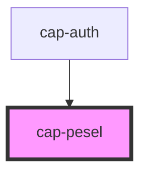

# cap-pesel

<!-- Auto Generated Below -->

## Properties

| Property      | Attribute     | Description | Type      | Default         |
| ------------- | ------------- | ----------- | --------- | --------------- |
| `isValid`     | `is-valid`    |             | `boolean` | `false`         |
| `placeholder` | `placeholder` |             | `string`  | `"National ID"` |
| `value`       | `value`       |             | `string`  | `undefined`     |

## Events

| Event              | Description | Type               |
| ------------------ | ----------- | ------------------ |
| `inputValueChange` |             | `CustomEvent<any>` |

## Methods

### `validate() => Promise<boolean>`

#### Returns

Type: `Promise<boolean>`

## Dependencies

### Used by

 - [cap-auth](../cap-auth)

### Graph

----------------------------------------------

*Built with [StencilJS](https://stenciljs.com/)*
