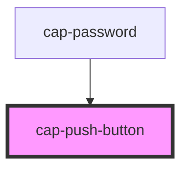

# cap-push-button

<!-- Auto Generated Below -->

## Properties

| Property | Attribute | Description | Type      | Default |
| -------- | --------- | ----------- | --------- | ------- |
| `on`     | `on`      |             | `boolean` | `false` |

## Events

| Event                   | Description | Type               |
| ----------------------- | ----------- | ------------------ |
| `pushButtonStateChange` |             | `CustomEvent<any>` |

## Dependencies

### Used by

 - [cap-password](../cap-password)

### Graph

----------------------------------------------

*Built with [StencilJS](https://stenciljs.com/)*
